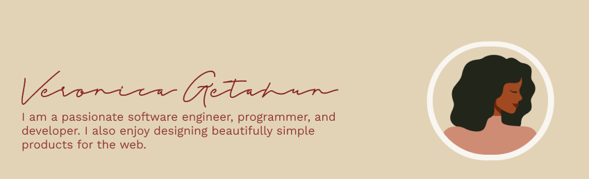

<!-- ### Hi there 👋 -->

<!--
**veronicaglh/veronicaglh** is a ✨ _special_ ✨ repository because its `README.md` (this file) appears on your GitHub profile.

Here are some ideas to get you started:

- 🔭 I’m currently working on ...
- 🌱 I’m currently learning ...
- 👯 I’m looking to collaborate on ...
- 🤔 I’m looking for help with ...
- 💬 Ask me about ...
- 📫 How to reach me: ...
- 😄 Pronouns: ...
- ⚡ Fun fact: ...
-->

# Hi, I'm Veronica

I am a software engineer who is passionate about developing websites and mobile applications. I am currently working on ReactJS and NodeJS. I am also intrested in machine learning, aritifical intelligence and  cybersecurity. I also enjoy learning new things and solving difficult problems. 

<b>Visitor's Count</b>

